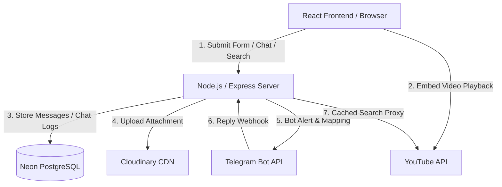

# Portfolio Codebase Audit Report

This report presents a comprehensive, professional, read-only audit of the portfolio website codebase located at `c:\merged_partition_content\amarjeet-portfolio`.

---

## 1. Executive Summary

The codebase is a modern, full-stack portfolio application featuring a React-based single-page application (SPA) frontend built with Vite and a Node.js/Express backend server that integrates a SQLite file (unused) and connects to a remote PostgreSQL database (Neon DB). The project has several advanced features such as real-time website chat integrated with a Telegram bot for administrator replies and a custom YouTube API proxy with client and server caching.

However, the codebase currently suffers from **critical security vulnerabilities** (live secrets committed to the repository, unauthenticated data exposure endpoint) and **structural redundancies** (a duplicate copy of the entire project nested inside the repository, conflicting styling systems, and multiple empty files). In its current state, the portfolio is **not ready** for professional recruiter or interview use. Fixing these critical items will immediately elevate the project's quality, security, and professional credibility.

---

## 2. Project Overview

The portfolio showcases the projects, skills, education, and credentials of **Amarjeet Yadav**, an MCA student at Lovely Professional University.

*   **Repository Location:** `c:\merged_partition_content\amarjeet-portfolio`
*   **Architecture Pattern:** Client-Server architecture.
    *   **Frontend (Client):** Single Page Application using React and React Router DOM.
    *   **Backend (Server):** Express.js API server handling contact form submissions, chat mapping, and YouTube search proxying.
    *   **Database:** Remote PostgreSQL instance on Neon DB.

---

## 3. Actual Technology Stack

The technology stack detected directly from code and configurations:

| Layer | Technology | Version | Notes / Usage |
| :--- | :--- | :--- | :--- |
| **Framework (FE)** | React | `^19.1.0` | Frontend framework using modern React 19 capabilities |
| **Build Tool** | Vite | `^7.0.0` | Bundler and dev server |
| **Routing** | React Router DOM | `^7.13.0` | Client-side routing in `App.jsx` |
| **Backend** | Express.js | `^4.18.2` | REST API endpoints in `server/server.js` |
| **Database** | PostgreSQL (`pg`) | `^8.16.3` | Database connector; connects to Neon DB |
| **Assets/Media** | Cloudinary | FE: `^2.9.0` / BE: `^2.2.0` | File uploading for contact form attachments |
| **Styling** | Vanilla CSS | N/A | Modular files: `index.css`, `Theme.css`, `Navbar.css`, `App.css` |
| **Icons** | React Icons | `^5.5.0` | Used in layout, projects, and theme toggle |
| **Fonts** | Google Fonts | N/A | Poppins, Bebas Neue, Caveat, Fira Code, Pacifico, Montserrat |
| **Notifications** | Telegram Bot API | N/A | Telegram integration for admin notification and interactive chat |
| **Video API** | YouTube Iframe Player API | N/A | Proxied custom search and video playing on `/learn` |
| **Process Manager** | Nodemon | `^3.1.0` (Dev) | Backend dev watcher |

---

## 4. Architecture Audit

### Architectural Highlights
1.  **Bidirectional Telegram Chat:** The integration between the website contact form and the Telegram Bot API is highly creative. When a visitor submits a contact form, it starts a chat session (`/contact/chat/:conversationId`). The admin is notified on Telegram and can reply to the Telegram message. The reply is delivered back to the visitor's live chat via a Telegram webhook endpoint (`/api/telegram/webhook`) and client polling.
2.  **YouTube Proxy and Cache:** The backend proxies YouTube requests to protect the developer's `YOUTUBE_API_KEY` and utilizes a dual-tier caching structure (in-memory Map caching and client-side LocalStorage cache) to stay within YouTube's daily API query limits.

---

## 5. Project Structure Audit

The workspace contains several inconsistencies and redundancies:

*   **Nested Redundant Repository:** The directory `amarjeet-portfolio/amarjeet-portfolio` is a duplicate of the entire codebase, including its own `.git` metadata, `.env` file, `node_modules`, and configuration files. This represents a ~50% overhead in file counts and disk footprint.
*   **Legacy/Backup Folders:** The folder `_profile_readme_push_20260706011146` is a remnant of automated profile scripts and should be removed.
*   **Unused Database File:** `database.sqlite` (12 KB) exists in the root folder, but the server connects exclusively to PostgreSQL. There is no SQLite implementation in the backend.
*   **Unused & Empty Files:**
    *   `src/Mobile.css` (0 bytes, unimported)
    *   `view-messages.js` (0 bytes, unused in root)
    *   `server/LearnSection.jsx` (0 bytes, misplaced React component in the backend folder)
    *   `public/sitemap.xml` (0 bytes, empty sitemap)
*   **Styling System Conflict:**
    *   `src/index.css` defines variables under `:root` (dark-first) and switches themes using `[data-theme="light"]`.
    *   `src/Theme.css` defines variables under `:root` (light-first) and switches themes using `[data-theme='dark']`.
    *   `Theme.css` targets a legacy class `.menu` which is completely absent from the actual `Navbar.jsx` component.

---

## 6. Functional Audit

*   **Navigation & Routing:**
    *   Client routes are implemented for `/`, `/projects`, `/skills`, `/education`, `/certifications`, `/contact`, and `/learn`.
    *   **Issue:** No 404/Catch-all route is configured. Navigating to an invalid route renders a blank layout content panel without displaying a proper 404 page.
*   **Home / Hero Section:**
    *   The typing animation functions correctly.
    *   The CTA buttons redirect correctly.
*   **Projects Page:**
    *   **Inaccuracy:** The projects are hardcoded in `Projects.jsx`. However, the description states the portfolio features "dynamic project fetching," which is incorrect.
    *   **Broken/Placeholder Links:** Out of 7 projects, 4 have no live demo URLs.
*   **Skills Page:**
    *   Interactive skill category tabs work correctly.
    *   **Categorization Issue:** `Laravel` (PHP backend MVC framework) is listed under the "Frontend" skills tab.
*   **Contact Section:**
    *   Contact form and chat integration are functional.
    *   **Security Issue:** Anyone can read all submitted user messages through an unauthenticated endpoint.
*   **Learn / YouTube Page:**
    *   The `/learn` route renders `SafeYouTube` successfully. Video searches, channel resolutions, and play progress logging work via proxy.

---

## 7. UI/UX Audit

*   **Visual Hierarchy & Colors:**
    *   The site uses a premium dark-first aesthetic. However, because `index.css` and `Theme.css` have conflicting colors and variable names, some text blocks suffer from sub-optimal contrast depending on the mode.
*   **Button and Component States:**
    *   Hover effects, transitions, and scaling animations (e.g., theme toggle icon rotating, buttons rising) are implemented.
*   **Outlines & Accessibility:**
    *   Focus indicator outlines are completely disabled (`outline: none` in `Theme.css:72` on focused inputs/textareas), reducing keyboard navigability scores.

---

## 8. Responsive Design Audit

*   **Media Query Specificity Bug:**
    In `src/App.css`, media queries are defined in the following order:
    1.  `@media (max-width: 1024px)`
    2.  `@media (max-width: 640px)`
    3.  `@media (max-width: 768px)`
    
    Because the `768px` block is written *after* the `640px` block, style overrides inside `768px` override the styles in `640px` for viewports under 640px. For example, `.hero-title` font-size is clamped in `640px` but overridden to a fixed `2rem` in the subsequent `768px` media query.
*   **Overflows:** Grid layouts split to single-columns correctly under `768px`.

---

## 9. Accessibility Audit

*   **🔴 Focus Indicators (High):** Focus outlines are disabled on form controls (`outline: none` in `Theme.css:72`). Focus states must remain visible for keyboard accessibility.
*   **🟡 Interactive Elements Semantics (Medium):** The `navbar-backdrop` overlay is clickable but lacks a keyboard-accessible click handler, role, or tabindex.
*   **🟡 Keyboard Traps (Medium):** The slide-out menu drawer doesn't trap keyboard focus when open. Keyboard users can navigate to elements behind the menu drawer.

---

## 10. Performance Audit

*   **🔴 Multiple Custom Fonts (Medium):** The `index.html` loads 6 different custom Google Fonts: `Poppins`, `Bebas Neue`, `Caveat`, `Fira Code`, `Pacifico`, and `Montserrat`. This slows down text rendering, blocks page loads, and causes Layout Shifts (CLS).
*   **🟡 Large Monolithic Bundle (Low):** The compiled JavaScript bundle is `281.97 kB`, which is large for a portfolio site. This is due to importing large icon families (`react-icons`) and routing packages in a single chunk. Code-splitting or icons tree-shaking is recommended.

---

## 11. SEO Audit

*   **🔴 Sitemap Location Inconsistency (Medium):** The `robots.txt` Sitemap reference points to `https://amarjeet-portfolio-blue.vercel.app/sitemap.xml`, which does not match the actual portfolio deployment host.
*   **🟡 Empty Sitemap (Medium):** `public/sitemap.xml` is an empty file (0 bytes).
*   **🟡 Client-Side SEO Hoisting (Low):** The `<SEO>` component hoists tags using React 19 client-side. Web crawlers that do not execute JavaScript will only see the static placeholder `<title>Amarjeet's Devfolio</title>` in the original HTML.
*   **🟡 Schema Markup (Low):** Structured metadata (JSON-LD) is missing for search engines.

---

## 12. Security Audit

*   **🔴 Exposed Secrets (Critical):** Live API keys, credentials, and credentials strings are committed directly to the git repository inside the root `.env` file and the nested directory `.env` file. These include:
    *   `DATABASE_URL` (Neon PostgreSQL database connection string with password)
    *   `CLOUDINARY_API_SECRET` (Cloudinary private API secret)
    *   `TELEGRAM_BOT_TOKEN` (Telegram Bot Token)
    *   `YOUTUBE_API_KEY` (YouTube search API key)
    
    *SECRET DETECTED — [.env](file:///c:/merged_partition_content/amarjeet-portfolio/.env)*
    *SECRET DETECTED — [amarjeet-portfolio/amarjeet-portfolio/.env](file:///c:/merged_partition_content/amarjeet-portfolio/amarjeet-portfolio/.env)*
*   **🔴 Unauthenticated API Leak (Critical):** The backend exposes `/api/messages` as a public `GET` endpoint. It returns all records from the `contact_messages` database table, leaking visitor names, email addresses, and messages to the public without authentication.
*   **🟡 Weak CORS Configuration (Low):** The Express backend uses `cors()` without specifying origins, allowing any external origin to query these endpoints.

---

## 13. Code Quality Audit

*   **🔴 ESLint Execution Failures (High):** Running `npm run lint` yields **145 errors**. The primary cause is that `eslint.config.js` configures browser-level globals (`globals.browser`) for all JS files, but does not provide Node-level environments (`globals.node`) for backend scripts (`server/server.js`, `start.js`).
*   **🟡 Dead Code & Unused Imports (Medium):**
    *   In `src/Navbar.jsx`, `useEffect` is imported but never used.
    *   `cloudinary` in the frontend `package.json` is never imported.
    *   `Mobile.css` is completely empty and unimported.
*   **🟡 Component Structure (Low):** `EducationTimeline.jsx` contains both `Certifications` and `EducationTimeline` components, making separation of concerns and file navigation less intuitive.

---

## 14. Dependency Audit

*   **Unused Frontend Dependency:** `cloudinary` in the root `package.json` is unused. It is only required in the backend (`server/package.json`).
*   **Vite/React Versioning:** The dependencies use modern React 19 and Vite 7.

---

## 15. Content & Resume Audit

*   **🔴 Broken / Placeholder LeetCode Link (High):** The main README.md LeetCode badge contains placeholder text (`Add Profile Link Here`) and points to the generic `https://leetcode.com/`. However, the layout footer points to the correct profile `https://leetcode.com/u/Amarjeet__Yadav/`.
*   **🔴 LinkedIn URL Inconsistency (High):** The README LinkedIn link points to `https://linkedin.com/in/amarjeetydv/` but the site footer link points to `https://linkedin.com/in/amarjeet-yadav-978820291`.
*   **🔴 Project Stack & Role Mismatches (High):**
    *   *Cafe Management System:* The README claims it is built with `Angular 17`, `Node.js`, and `Express`. The `Projects.jsx` array claims it is built with `HTML/CSS/JS`, `PHP`, and `MySQL`.
    *   *Auto Theft Guard:* The codebase lists this project as `Auto Theft Guard`, but the README refers to it as the `Vehicle Fuel Protection Application`.
*   **🟡 Frontend Laravel Mismatch (Medium):** `Laravel` is listed as a "Frontend" skill in `Skills.jsx`, despite being a PHP backend framework.

---

## 16. Recruiter / ATS / Interview Readiness

*   **Recruiter Readiness:** **Low**. Multiple broken placeholders in the README, LinkedIn URL inconsistencies, and mismatched stacks on projects diminish professional credibility.
*   **Technical Interviewer Readiness:** **Medium-Low**. While the chat and video proxy implementations showcase good full-stack capabilities, a technical reviewer inspecting the source code will notice the exposed credentials, ESLint errors, and unauthenticated message endpoints, which represent significant liabilities.

---

## 17. Project Credibility Audit

*   **Unhosted Projects:** Out of 7 projects listed in `Projects.jsx`, only 3 have valid live demo links.
*   **Mismatched Descriptions:** The project claims in the README do not match the stack lists in the source code.

---

## 18. Build & Deployment Audit

*   **Vite Production Build:** Verified. The production build (`npm run build`) runs successfully and bundles client assets in `3.16s` with no compiler warnings or errors.
*   **Deployment Blockers:** Since credentials are saved in `.env` files checked into Git, deploying this repository as-is to Render/Vercel poses a security threat. Credentials must be deleted from the Git index and configured as secure environment variables.

---

## 19. Documentation Audit

*   The `.github/copilot-instructions.md` documents a React, Node, and MySQL stack, but the server code has been migrated to connect to PostgreSQL.
*   The README has placeholder LeetCode links and conflicting project stack documentation.

---

## 20. Detailed Findings Table

| ID | Category | Severity | File / Path | Problem | Why It Matters | Recommended Action |
| :--- | :--- | :--- | :--- | :--- | :--- | :--- |
| **F-01** | Security | 🔴 Critical | [.env](file:///c:/merged_partition_content/amarjeet-portfolio/.env) | Exposed Neon database connection string and API keys committed in Git. | Exposes database and integrations to public manipulation. | Move secrets to host environment variables and run git-filter-repo to clean history. |
| **F-02** | Security | 🔴 Critical | [server.js](file:///c:/merged_partition_content/amarjeet-portfolio/server/server.js#L1139-L1150) | `/api/messages` GET endpoint has no authentication layer. | Exposes private user contact records to public scraping. | Add basic/JWT auth or remove the endpoint if public reading isn't required. |
| **F-03** | Structure | 🟠 High | [amarjeet-portfolio](file:///c:/merged_partition_content/amarjeet-portfolio/amarjeet-portfolio) | Nested duplicate directory of the entire workspace. | Increases disk usage and confuses build processes/linters. | Safely delete the nested duplicate directory. |
| **F-04** | Content | 🟠 High | [README.md](file:///c:/merged_partition_content/amarjeet-portfolio/README.md#L160) | Placeholder LeetCode link ("Add Profile Link Here"). | Appears unfinished and reduces recruiter credibility. | Update link with the user's LeetCode profile URL. |
| **F-05** | Content | 🟠 High | [README.md](file:///c:/merged_partition_content/amarjeet-portfolio/README.md) vs [Projects.jsx](file:///c:/merged_partition_content/amarjeet-portfolio/src/Projects.jsx) | Inconsistent project stacks (Angular vs PHP for Cafe Management). | Creates confusion and looks unprofessional. | Align project descriptions and tech stacks across both files. |
| **F-06** | Code Quality | 🟠 High | [eslint.config.js](file:///c:/merged_partition_content/amarjeet-portfolio/eslint.config.js) | Lacks Node.js configuration; 145 linter errors. | Fails standard automated quality tests during builds. | Update linter configuration to include Node globals for server scripts. |
| **F-07** | Responsive | 🟠 High | [App.css](file:///c:/merged_partition_content/amarjeet-portfolio/src/App.css#L1127-L1297) | Out-of-order CSS media queries (`1024px` -> `640px` -> `768px`). | 768px rules override 640px rules on small mobile viewports. | Re-order media queries in descending width order. |
| **F-08** | Accessibility | 🟠 High | [Theme.css](file:///c:/merged_partition_content/amarjeet-portfolio/src/Theme.css#L72) | Focused inputs outline is set to `none`. | Keyboard navigation users cannot track active element focus. | Remove `outline: none` and implement visible focus rings. |
| **F-09** | Content | 🟡 Medium | [Skills.jsx](file:///c:/merged_partition_content/amarjeet-portfolio/src/Skills.jsx#L13) | `Laravel` is categorized under the "Frontend" tab. | Technically incorrect and reduces interviewer confidence. | Move Laravel to the "Backend" skills category. |
| **F-10** | SEO | 🟡 Medium | [robots.txt](file:///c:/merged_partition_content/amarjeet-portfolio/public/robots.txt#L4) | Sitemap URL points to incorrect domain. | Search engine crawlers fail to find sitemap correctly. | Update URL to match target deployment domain. |
| **F-11** | SEO | 🟡 Medium | [sitemap.xml](file:///c:/merged_partition_content/amarjeet-portfolio/public/sitemap.xml) | Empty Sitemap file (0 bytes). | SEO indexing is sub-optimal. | Generate static sitemap URLs in `sitemap.xml`. |
| **F-12** | Performance | 🟡 Medium | [index.html](file:///c:/merged_partition_content/amarjeet-portfolio/index.html#L20-L21) | 6 Google Fonts imported. | Generates blocking asset requests on load. | Consolidate or select only 1-2 primary typography families. |
| **F-13** | Structure | 🔵 Low | `view-messages.js`, `server/LearnSection.jsx`, `src/Mobile.css` | Empty leftover files in the codebase. | Clutters workspace files. | Delete empty placeholder files. |
| **F-14** | Code Quality | 🔵 Low | [Navbar.jsx](file:///c:/merged_partition_content/amarjeet-portfolio/src/Navbar.jsx#L1) | Unused `useEffect` import. | Minor linter warnings and noise. | Remove unused imports. |

---

## 21. Scorecard

| Category | Score | Notes |
| :--- | :---: | :--- |
| **Code Quality** | **6.0 / 10** | Built cleanly but linter crashes due to configuration gaps and has unused imports. |
| **Architecture** | **7.5 / 10** | Bidirectional chat and proxy layers are very well-architected. |
| **UI/UX** | **7.0 / 10** | Nice dark aesthetic, animations are good, but variables are messy. |
| **Responsive Design**| **6.0 / 10** | Mobile layout collapses, but media queries override order is broken. |
| **Accessibility** | **5.5 / 10** | Outline is disabled on inputs; keyboard navigation is difficult. |
| **Performance** | **7.0 / 10** | Fast build times, but loading 6 Google Fonts causes latency. |
| **SEO** | **5.0 / 10** | Empty sitemap, wrong sitemap host URL, no JSON-LD schema. |
| **Security** | **1.0 / 10** | Live secrets committed; unauthenticated DB messages endpoint. |
| **Content Quality** | **5.5 / 10** | Laravel listed in frontend, placeholders, and mismatched readme stacks. |
| **Recruiter Readiness**| **5.0 / 10** | Discrepancies and broken placeholders reduce hiring attractiveness. |
| **Interview Readiness**| **5.0 / 10** | Architecture is strong, but code security issues won't pass technical review. |
| **Project Credibility**| **6.0 / 10** | Good project descriptions, but lacks live links for most projects. |
| **Documentation** | **5.0 / 10** | Readme needs updates to remove placeholders and match actual codebase. |
| **Deployment Readiness**| **4.0 / 10** | Must separate environment credentials before hosting safely. |
| **OVERALL SCORE** | **53 / 100** | **Needs Improvement** (Critical fixes required before public release) |

---

## 22. Priority Roadmap

### Phase 1 — Must Fix (🔴 Critical / 🟠 High)
1.  **Remove Committed Secrets:** Move `.env` configurations to host environment settings and purge commit history to invalidate leaked keys.
2.  **Secure messages endpoint:** Remove `/api/messages` or restrict it behind authentication middleware.
3.  **Delete Nested Redundant Folder:** Remove `amarjeet-portfolio/amarjeet-portfolio` directory.
4.  **Fix ESLint Configuration:** Add Node.js configuration targets to `eslint.config.js` to fix the 145 linter errors.
5.  **Fix Project Inconsistencies:** Update project details in the README and codebase so descriptions and stacks match. Remove broken LeetCode placeholder in the README.

### Phase 2 — Professional Polish (🟠 High / 🟡 Medium)
6.  **Fix CSS Media Queries:** Order CSS media queries correctly in `App.css`.
7.  **Enable visible focus outline:** Restore keyboard focus ring indications.
8.  **Re-categorize Laravel:** Move Laravel from "Frontend" to "Backend" in `Skills.jsx`.
9.  **Link Consolidation:** Update inconsistent LinkedIn links.

### Phase 3 — Performance & SEO (🟡 Medium)
10. **Reduce Font Imports:** Consolidate Google Fonts in `index.html` down to 2 families.
11. **Fix Sitemap and Robots.txt:** Generate `sitemap.xml` and correct the sitemap URL in `robots.txt`.
12. **Remove Unused dependencies:** Clean up empty files and prune `cloudinary` from frontend dependencies.

---

## 23. Recommended Next Steps

1.  **Purge Credentials:** Immediately revoke and regenerate the compromised Neon database password, Telegram bot token, Cloudinary secrets, and YouTube API keys.
2.  **Implement Security Fixes:** Secure the Express endpoints.
3.  **Clean Codebase:** Run cleanup scripts to remove duplicate directories and empty files.

---

## VERY IMPORTANT FINAL REQUIREMENT

### FACTUAL FINDINGS
1.  **Exposed Credentials:** A live `.env` file containing database passwords, Telegram bot tokens, Cloudinary api secrets, and YouTube API keys is committed in the root workspace.
2.  **Duplicate Codebase:** A duplicate copy of the workspace is present at `/amarjeet-portfolio/amarjeet-portfolio`.
3.  **Leaked Endpoint:** `/api/messages` returns visitor contact database rows without checking credentials.
4.  **Linter Errors:** Running `npm run lint` fails with 145 errors due to missing node globals configurations.
5.  **Empty Files:** `view-messages.js`, `server/LearnSection.jsx`, `src/Mobile.css`, and `public/sitemap.xml` are 0-byte files.
6.  **Unused dependency:** `cloudinary` is listed in frontend `package.json` but is never imported.
7.  **Content Inconsistencies:** The LeetCode link in README has an "Add Profile Link Here" placeholder, and the LinkedIn URL in README differs from the Layout.jsx footer link.
8.  **Laravel Placement:** Laravel is listed under the "Frontend" skills tab in `Skills.jsx`.

### INFERRED ISSUES
1.  **Media Query Overrides:** Media query ordering (`1024px` -> `640px` -> `768px`) causes viewport styling override issues on mobile viewports due to CSS cascading order.
2.  **Unused Style Classes:** CSS variables in `Theme.css` and `index.css` clash and override each other unpredictably. The `.menu` class styled in `Theme.css` is unused in the active `Navbar.jsx` structure.
3.  **404 Route Gaps:** Lack of a catch-all route (`*`) in `App.jsx` likely causes blank or broken layout displays when invalid URLs are requested.

### RECOMMENDATIONS
1.  **Credentials Rotation:** Immediately regenerate and move all secrets to secure environment variables.
2.  **Endpoint Authentication:** Restrict API routes from public scraping.
3.  **Clean up directory:** Delete nested duplicate repositories and empty placeholders.
4.  **Consolidate Styling Variables:** Merge `Theme.css` and `index.css` into a single CSS variable system and use standard cascading theme classes.
5.  **Update Content:** Revise project stacks, link configurations, and skills categories in frontend views and the README.

> **Audit Status: READ-ONLY — No source-code changes were made during this audit.**
